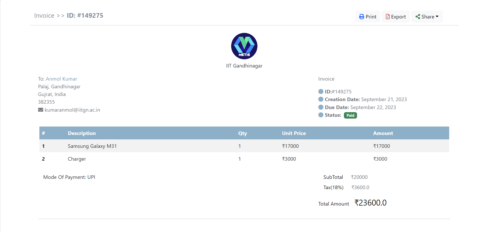

# Invoice-Generator

Simple Billing Portal made uing python flask Web Framework. This aims to be implemented on food outlets.



## Features

1. Print and Share to whatsapp.
2. Save Billing Details to MongoDB Database.
3. The Data can be retrived back after Login.

## Example Usage

# Local Installation

> Clone to the local machine using git

```
git clone
```

> change directory and install depedencies using below commands

```
cd Invoice-Generator
pip install -r requirements.txt
```

> Database and Image hosting

### Mongo DB

you can sign up at [Mongo DB](https://www.mongodb.com/) and create a free cluster and set your URI as env variable `MONGO_URI`

### ImgBB

you can sign up at [ImgBB](https://imgbb.com/) and get your API key and then set it as env variable `ImgBB_API_KEY`

> Run local server using

### Linux based OS

```
python3 index.py
```

### Windows

```
py index.py
```

> Now open any browser on your computer and enter this link `http://127.0.0.1:8080` and press enter.

You should be able to see the app running.
